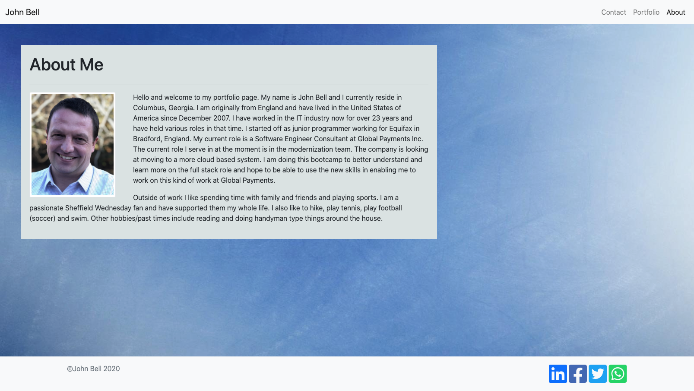
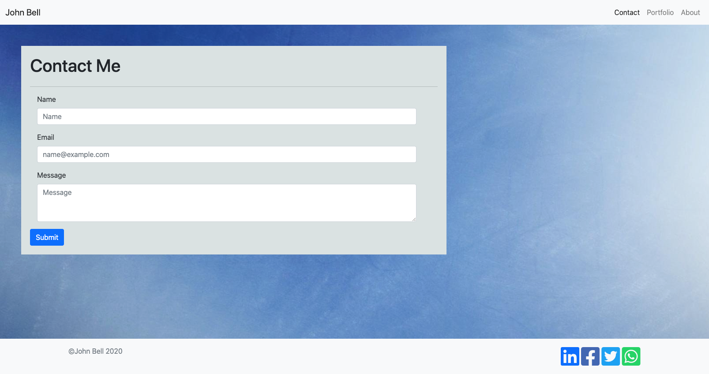
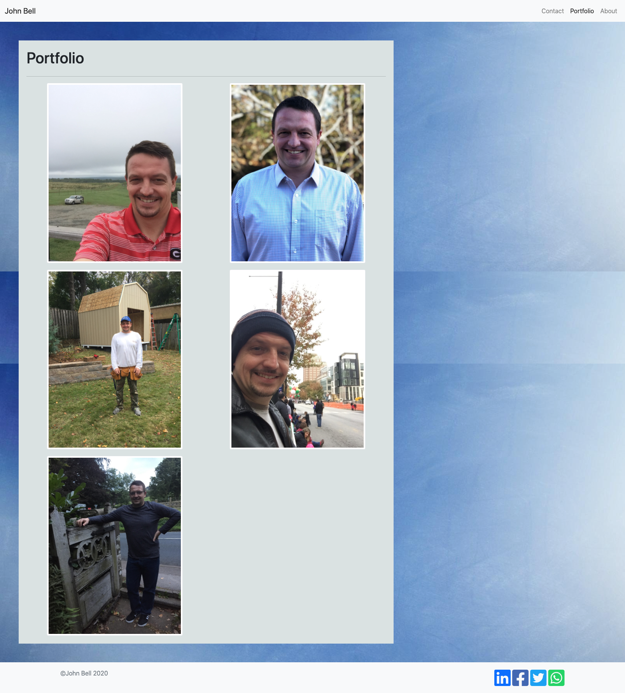

# Portfolio

 [](https://github.com/jdbell123/portfolio/issues)
 [](https://github.com/jdbell123/portfolio/stargazers)
## Table of Contents

* [Reason](#reason)
* [Learnt](#learnt)
* [Take-Aways](#Take-Aways)
* [Installation](#installation)
* [Usage](#usage)
* [Credits](#credits)
* [License](#license)
* [Links](#links)

***

## Reason

The reason for this assignment this week was to learn how to build a wesite that used a responsive portfolio. We were given the following Directions and Requirements:

```
DIRECTIONS:
First, you will use the Bootstrap CSS Framework to create a mobile responsive portfolio. How do you deliver this? Here are some guidelines:

* Create the following files files: `index.html`, `portfolio.html` and `contact.html`.

* Using Bootstrap, develop your portfolio site with the following items:

   * A navbar

   * A responsive layout

   * Responsive images

* The Bootstrap portfolio should minimize the use of media queries.
```

```
MINIMUM REQUIREMENTS:
## Minimum Requirements

* Functional, deployed application

* GitHub repository with README describing the project

* Navbar must be consistent on each page.

* Navbar on each page must contain links to Home/About, Contact, and Portfolio pages.

* All links must work.

* Must use semantic html.

* Each page must have valid and correct HTML. (use a validation service)

* Must contain your personalized information. (bio, name, images, links to social media, etc.)

* Must properly utilize Bootstrap components and grid system.

### Bonus

* Using Bootstrap, make a sticky footer and use sub-rows and sub-columns on your portfolio site (**Hint:** Check out the Bootstrap documentation).
```

---

## Learnt

Working on this project I have learnt about the following things:

    1 - Semantic HTML elements
    2 - The structure of HTML elements
    3 - Adding alt attributes to images
    4 - Ordering heading attributes
    5 - About the title element
    6 - How to write a good ReadMe file
    7 - Use media queries
    8 - Structure a multi-page site correctly
    9 - Use Bootstrap classes
    10 - How to create and use a Navbar
    11 - How to create and use a sticky footer

---

## Take-Aways

Practice, practice practice. This is key in learning and remembering things. Bootstrap has a lot of things to it and you sometimes just need to play with the code and try things to work out how it works etc.

---

## Installation

This project doesn't require any install steps. Just navigate to the URL to see the website.

* [Links](#links)

---

## Usage 

Here are screenshots of the entire website.

About Me Page (index.html)




Contact Me Page (contact.html)




Portfolio Page (portfolio.html)




---

## Credits

Big shout out to Google for being my best friend during the week. Also, thanks to all the other students in the bootcamp who have been part of study groups etc. and of course to the teaching staff for helping me out when needed. 

---

## License


Licensed under the [MIT](./assets/license.txt) license.


---

## Links

[GitHub Repo](https://github.com/jdbell123/portfolio)

[Website](https://jdbell123.github.io/portfolio/)